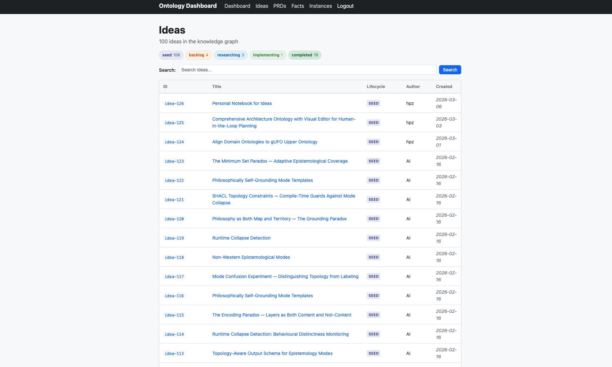
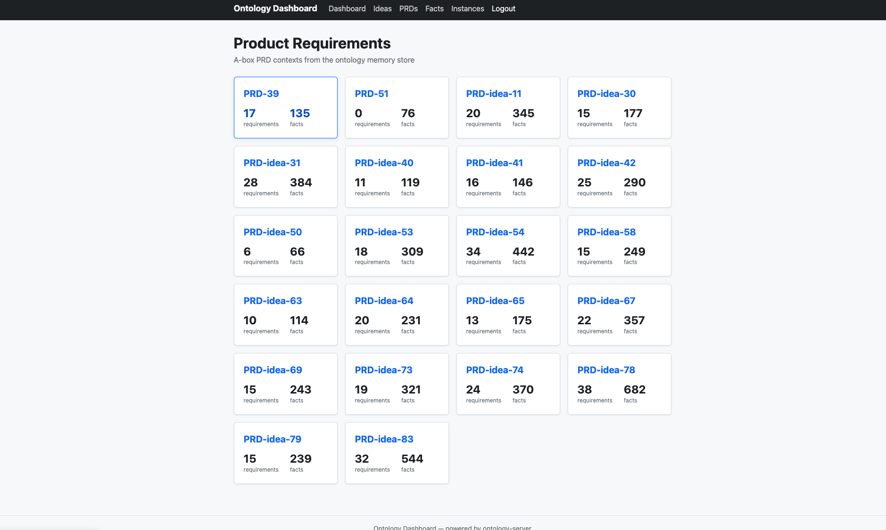
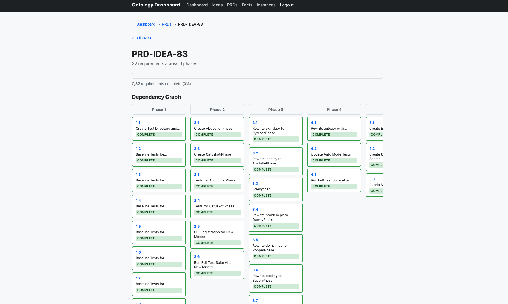
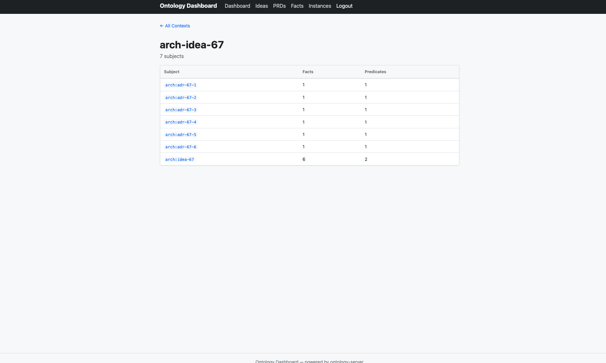

# Tulla in Action

Every idea starts as a one-liner — a hunch, a question, something overheard. Tulla's job is to take that seed and carry it all the way to working code, without losing the reasoning along the way. Here's what that looks like from the inside.

## 1. Everything begins in the idea pool

When Tulla captures a new idea it enters the knowledge graph as a **seed**. Over time, ideas move through lifecycle states — backlog, researching, implementing, completed — or get parked and invalidated when they turn out to be dead ends. At the time of this screenshot, the pool holds over 100 ideas, a mix of human-authored and AI-generated ones. Most are still seeds. That's normal: the funnel is intentionally wide.

## 2. Surviving ideas get a PRD

Ideas that make it through discovery and research are scoped into a Product Requirements Document. The PRD overview shows every idea that reached this stage. The two numbers on each card — requirements and facts — tell you how complex the idea turned out to be and how much the agent learned during research. PRD-idea-74, for instance, accumulated 370 facts across 24 requirements. That's a lot of context the agent would normally forget between sessions; here it's persisted in the ontology.

## 3. Requirements become a dependency graph

Zooming into a single PRD — idea 83, "Philosopher-Grounded Generative Modes" — reveals how Tulla breaks work into phased implementation. Each box is a concrete task (create a test, rewrite a module, run the full suite). Tasks are ordered by dependency: Phase 1 lays groundwork, Phase 2 builds on it, and so on. The green "COMPLETE" badges show the agent working its way through the graph autonomously. No task runs until its dependencies are satisfied.

## 4. Decisions are tracked, not buried

Behind every implementation sits a trail of architecture decisions. This view shows the ADRs for idea 67 — six decisions recorded as named subjects in the knowledge graph, each linked to iSAQB quality attributes like maintainability or reliability. When the agent revisits this idea later (or a different agent picks it up), the *why* behind each choice is still there, queryable via SPARQL, not lost in a chat transcript.

---

This is the core loop: capture widely, research thoroughly, plan explicitly, implement traceably. The ontology is the thread that holds it all together.
